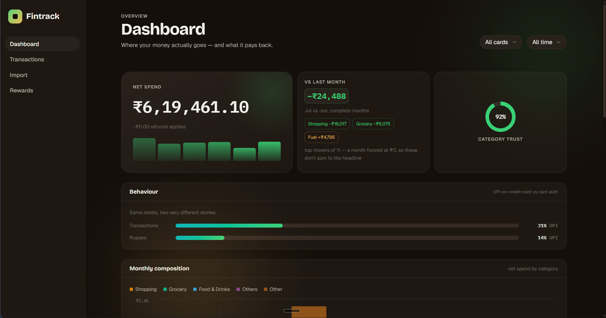
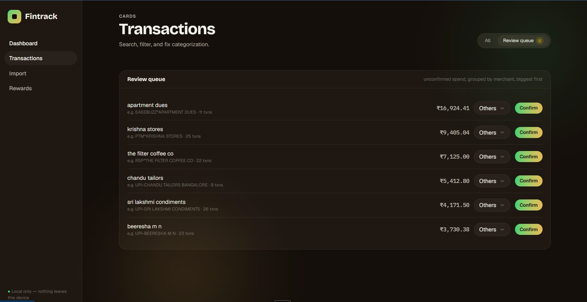
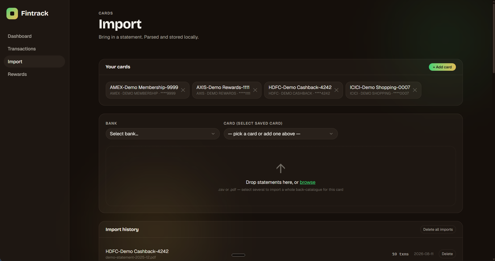
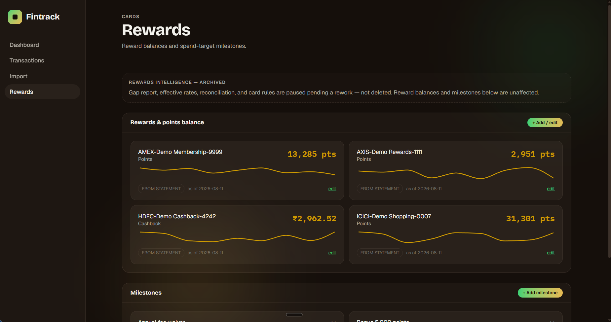

# Hisaab

*हिसाब — the account, the reckoning. As in "hisaab do": account for it.*

A local-only personal finance app for Indian credit cards. It parses bank statement
PDFs and CSVs, categorises transactions at the merchant level with an explicit
confidence signal, and answers the question a per-card banking app can't: **where does
the money actually go, across every card, over any period.**

Flask + SQLite backend, React + TypeScript + Tailwind frontend. Single user, runs on
`localhost`, no auth, no cloud, no telemetry. The database is one file on disk.

> **Scope of this repository.** This is the card module — import, categorisation,
> dashboard, rewards.
> No statements, no database, and no personal financial data are included — see
> [Bring your own data](#bring-your-own-data).



*Every screenshot on this page is the demo dataset — `python app.py --demo` — not
anyone's real spending.*

## What it does

- **Statement import** — six PDF parsers (HDFC, ICICI, Axis, Kotak, IDFC First, Amex)
  plus CSV, including password-protected PDFs. Passwords are used in memory to unlock
  a file and never stored. Duplicate protection is two-layered: a SHA-256 hash rejects
  byte-identical re-uploads outright, and an overlapping-period check refuses a
  statement that covers dates already imported for that card unless you force it.
- **Merchant-level categorisation** — descriptions are normalised (payment-gateway
  prefixes, trailing city names and reference blocks peeled off), then matched against
  a merchant/alias table by longest substring. Every transaction records *where* its
  category came from: a confirmed merchant rule, a suggestion, the issuer's own
  category, a keyword fallback, or an explicit manual pin.
- **A review queue with a trust meter** — uncategorised spend is grouped by normalised
  merchant, biggest first. Confirming one group restamps every matching transaction in
  a single round trip, and the dashboard reports the paise-weighted share of spend you
  have actually vouched for. Fix a merchant once, it stays fixed.
- **Dashboard** — spend by category and card, monthly composition, top merchants
  (canonicalised, not gateway duplicates), month-on-month movers, and a UPI-vs-card
  behaviour lens: on real data, UPI-on-credit-card was 52% of *transactions* but only
  11% of the *rupees*, which ranking by rupees alone completely hides.
- **Rewards** — dated reward-balance history per card (so importing statements out of
  order can't regress a balance) and windowed spend milestones whose progress is a live
  query, not a stored counter.

### The review queue

Unconfirmed spend, grouped by normalised merchant, biggest first. Note the `e.g.` line
under each: the raw description the bank actually sent (`EASEBUZZ*APARTMENT DUES`,
`RSP*THE FILTER COFFEE CO`) against the merchant it normalises to. One click confirms
the whole group and every future transaction that matches it.



### Import

Card registry, drag-and-drop statement import, and the history of what has already been
ingested. A statement whose period overlaps one you've already imported is refused
rather than silently double-counted.



### Rewards

Dated balance history per card, so an out-of-order import corrects a balance instead of
regressing it, with spend-target milestones underneath.



## Try it in 30 seconds

The app ships with no data, so there is a demo mode that invents some:

```bash
pip install -r requirements.txt
npm install --prefix frontend
./build.ps1
python app.py --demo
```

That generates around 600 fabricated transactions across four invented cards
(`scripts/seed_demo.py`) into a **separate** `data/hisaab-demo.db` and serves them
at http://127.0.0.1:5000. Every rupee of it is made up. Your real database, if you
have one, is never opened. The generator is seeded, so a given day reproduces
exactly; it spans the last nine months, so the running total grows as the current
month fills in.

The demo is shaped to show the parts worth looking at rather than just to fill
tables: one merchant appears under four different rail disguises (`UPI-SWIGGY
BANGALORE`, `SWIGGYBANGALORE`, `RAZ*SWIGGY`, `PTM*SWIGGY LIMITED MUMBAI`) so you can
watch the normaliser collapse them into a single canonical row of ~100 transactions;
about a sixth of spend is left unconfirmed, so the review queue has six real groups
in it and the trust meter reads ~92% rather than a meaningless 100%.

## Running it for real

Windows-oriented (the helper scripts are PowerShell), but nothing in the app is
Windows-specific. Requires Python 3.11+ and Node 20+.

```bash
./build.ps1     # build the React app into frontend/dist
python app.py   # serve the API + built SPA at http://127.0.0.1:5000
```

For frontend work, `./dev.ps1` runs Flask alongside Vite with HMR on `:5173`. Note
that `python app.py` serves the *built* bundle — after a frontend change you need
`./build.ps1` before `:5000` shows it.

```bash
./test.ps1                                  # the full suite
python scripts/gen_expectations.py --check  # parser output drift check
./migrate.ps1                               # apply pending schema migrations
```

## Bring your own data

This repository ships **no statements and no database.** Bank statements are real
financial documents, so the test corpus is deliberately empty and the whole
golden-file suite skips on a fresh clone (it reports as skipped, not failed). Add your
own statements to `tests/corpus/tier1/` and run `scripts/gen_expectations.py` to turn
it on — see [tests/corpus/tier1/README.md](tests/corpus/tier1/README.md).

The rewards rules engine reads per-card YAML files from a `ccyamls/` directory that is
likewise not published, since a card-rules file names the specific cards its author
holds. Without it the engine simply has no rules to seed; everything else runs.

## Design decisions worth knowing

The reasoning lives in [docs/](docs/) — a product spec, an architecture decision
record, a phased backlog and a decision log. The four that shape the code most:

- **Money is integer paise, everywhere** (ADR-005). Floats drift under aggregation and
  multiplication. Rupees exist in exactly two places: what a parser reads off a
  statement, and what the frontend formats for display. The conversion happens once at
  each boundary.
- **Golden-file parser tests** (ADR-006). Every corpus statement is pinned to its exact
  parsed output, so a parser change that alters any row fails loudly. Parsers also
  return the statement's printed period and totals, which are reconciled against the
  sum of what was parsed. A finding from doing this: "Total Amount Due" is a *balance*,
  not the sum of debits, on every bank tested except one.
- **Schema changes are versioned migrations** (ADR-007). `PRAGMA user_version`, one
  transaction per migration, a `verify()` that runs inside it, and a rolled-back
  version bump if verification fails. Nine migrations so far, each with tests.
- **Categorisation states its confidence** (ADR-009). The earlier keyword-substring
  approach with an order-dependent override table produced categories nobody could
  audit. Now every transaction says where its category came from, and a migration that
  reclassified anything would have been a bug — the one that introduced this model
  asserts it changed zero stored categories.

## Status

A working personal tool, actively developed, not a product. There is no multi-user
story, no hosted version, and no intention of either. If you are here for the parsers
or the categorisation pipeline, those are the parts most likely to be useful to you.

## License

MIT — see [LICENSE](LICENSE).
